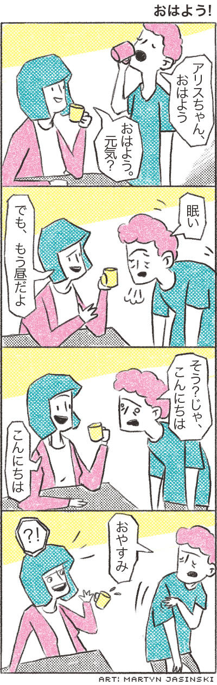

# [Male/Femal Speech](http://www.guidetojapanese.org/learn/complete/male_female)

As opposed to polite speech, which is mostly gender-neutral, casual speech has many constructions that make it sound masculine or feminine to varying degrees. Of course, you do not have to be a specific gender to use either masculine or feminine manners of speech but you do need to be aware of the differences and the impression it gives to the listener. The first example of this is how `ね` and `よ` are used in casual speech.

## Declarative `だ`

The declarative `だ` is attached to nouns and na-adjectives to give it a more declarative tone and make the state-of-being explicit. This is important in some grammatical forms we will cover later. For now, we can use it in casual Japanese to give a more definitive, confident, and somewaht masculine tone (though females often use it as well). For males, in particular, it is important to use it before `ね` or `よ` to void sounding too feminine.

__Note:__ *Only* attach `だ` to nouns and na-adjectives. *Never* to i-adjectives.

__Vocabulary__

1. <ruby>日<rt>に</rt>本<rt>ほん</rt>語<rt>ご</rt></ruby> - Japanese language
1. <ruby>上<rt>じょう</rt>手<rt>ず</rt></ruby> (na-adj) - skillful, good at
1. <ruby>楽<rt>たの</rt>しい</ruby> (i-adj) - fun

__Example__

1. <ruby>日<rt>に</rt>本<rt>ほん</rt>語<rt>ご</rt>は、<rt></rt>上<rt>じょう</rt>手<rt>ず</rt>ね。</ruby>
1. <ruby>日<rt>に</rt>本<rt>ほん</rt>語<rt>ご</rt>は、<rt></rt>上<rt>じょう</rt>手<rt>ず</rt>だね。</ruby>
1. <ruby>日<rt>に</rt>本<rt>ほん</rt>語<rt>ご</rt>は、<rt></rt>楽<rt>たの</rt>しいよ。</ruby>

__Vocabulary__

1. おはよう - good morning (casual)
1. <ruby>元<rt>げん</rt>気<rt>き</rt></ruby> (na-adj) - healthy; lively
1. <ruby>眠<rt>ねむ</rt>い</ruby> (i-adj) - sleepy
1. でも - but
1. もう - already
1. <ruby>昼<rt>ひる</rt></ruby> - afternoon
1. じゃ - then (abbr. of それでは)
1. こんにちは - Good day
1. <ruby>お<rt></rt>休<rt>やす</rt>み</ruby> - good night (expression for going to sleep)

__Comic 3__

ジョン : アリスちゃん、おはよう。

アリス : おはよう、元気？

ジョン : 眠い。

アリス : でも、もう昼だよ。

ジョン : そう？じゃ、こんにちは。

アリス : こんにちは。

ジョン : お休み。

__Vocabulary__

1. <ruby>宿<rt>しゅく</rt>題<rt>だい</rt></ruby> - homework
1. <ruby>難<rt>むずか</rt>しい</ruby> (i-adj) - difficult
1. <ruby>簡<rt>かん</rt>単<rt>たん</rt></ruby> (na-adj) - easy
1. うーん - umm
1. <ruby>多<rt>た</rt>分<rt>ぶん</rt></ruby> - probably; maybe
1. どっち - which one; which way

__The homework is easy!__

アリス : <ruby>宿<rt>しゅく</rt>題<rt>だい</rt>は、<rt></rt>難<rt>むずか</rt>しい？</ruby>

ジョン : <ruby>簡<rt>かん</rt>単<rt>たん</rt>だよ。</ruby>

アリス : 本当？

ジョン : <ruby>うーん、<rt></rt>多<rt>た</rt>分<rt>ぶん</rt>難<rt>むずか</rt>しいよ。</ruby>

アリス : どっちよ。

Because John is made, he decides to use `だ` with `よ` with the na-adjective `簡単`. However, regardless of gender, you cannot use `だ` with i-adjectives so he says `難しいよ`. *難しい~~だ~~よ* is grammatically incorrect.