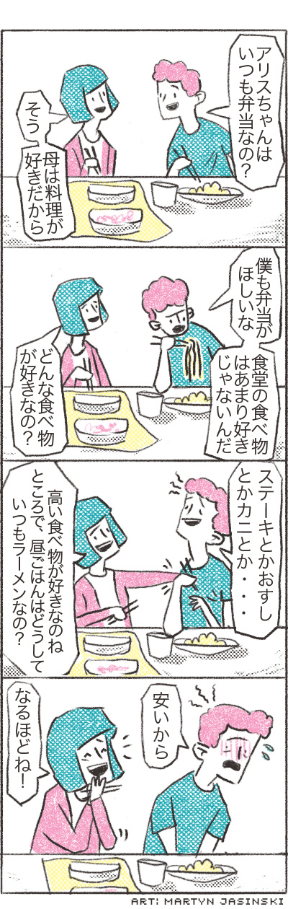

# [Chapter summary and practice](http://www.guidetojapanese.org/learn/complete/chapter2_summary)

In this chapter, we learned how to use nouns and adjectives to describe what something is or isn't. Here is a simple list of examples using the various conjugations we learned in this chapter.

<table>
    <caption>Nouns and Adjectives Conjugation Examples</caption>
    <tbody>
        <tr>
            <th></th>
            <th>Positive</th>
            <th>Negative</th>
            <th>Positive Polite</th>
            <th>Negative Polite</th>
        </tr>
        <tr>
            <th>Noun</th>
            <td>学生</td>
            <td>学生じゃない</td>
            <td>学生です</td>
            <td>学生じゃないです</td>
        </tr>
        <tr>
            <th>Na-adjective</th>
            <td>元気</td>
            <td>元気じゃない</td>
            <td>元気です</td>
            <td>元気じゃないです</td>
        </tr>
        <tr>
            <th>I-adjective</th>
            <td>忙しい</td>
            <td>忙しくない</td>
            <td>忙しいです</td>
            <td>忙しくないです</td>
        </tr>
        <tr>
            <th>Exception</th>
            <td>いい</td>
            <td>よくない</td>
            <td>いいです</td>
            <td>よくないです</td>
        </tr>
    </tbody>
</table>

## Questions using state-of-being

Now that we're familiar with the state-of-being, we can already ask and answer many different types of questions that involve what something or someone is. This includes asking simple yes/no questions or by using a question word.

__Various ways to say yes or no__

1. はい - yes (polite)
1. ええ - yes (polite)
1. いいえ - no (polite)
1. うん - yes (casual)
1. ううん - no (casual)

__Various question words__

1. <ruby>何<rt>なに/なん</rt></ruby> - what
1. <ruby>誰<rt>だれ</rt></ruby> - who
1. いつ - when
1. どう - how
1. どんな - what kind of
1. どうして - why
1. なんで - why (casual)

The word for "what" or `何` is a bit tricky because it has two readings. When used by itself, it is always pronounced `なに`. However, as we've already seen, when used with `です` it is read as `なん`. There are other cases when it is read as `なん` as we'll see later.

As you begin to practice speaking Japanese, you can apply what we've learned in this chapter to ask various ice-breaker questions.

__Vocabulary__

1. <ruby>趣<rt>しゅ</rt>味<rt>み</rt></ruby> - hobby; interests
1. <ruby>一<rt>いち</rt>番<rt>ばん</rt></ruby> - number 1; the best; the most
1. <ruby>好<rt>す</rt>き</ruby> (na-adj) - likable
1. <ruby>日<rt>に</rt>本<rt>ほん</rt></ruby> - Japan
1. <ruby>食<rt>た</rt>べ<rt></rt>物<rt>もの</rt></ruby> - food
1. <ruby>英<rt>えい</rt>語<rt>ご</rt></ruby> - English
1. <ruby>難<rt>むずか</rt>しい</ruby> (i-adj) - difficult
1. <ruby>授<rt>じゅ</rt>業<rt>ぎょう</rt></ruby> - class
1. <ruby>楽<rt>たの</rt>しい</ruby> (i-adj) - fun
1. <ruby>音<rt>おん</rt>楽<rt>がく</rt></ruby> - music

__Sample ice-breaker questions__

1. 趣味は、何ですか。
1. 一番好きな食べ物は、何ですか。
1. 日本の食べ物は好きですか。
1. 英語は、難しいですか。
1. 授業は、楽しいですか。
1. どんな音楽が好きですか。

---

__Vocabulary__

1. いつも - always
1. <ruby>弁<rt>べん</rt>当<rt>とう</rt></ruby>
1. そう - (things are) that way
1. <ruby>母<rt>はは</rt></ruby> - mother
1. <ruby>料<rt>りょう</rt>理<rt>り</rt></ruby> - cooking; cuisine; dish
1. <ruby>好<rt>す</rt>き</ruby> (na-adj) - likable; desirable
1. <ruby>僕<rt>ぼく</rt></ruby> - me, myself (polite, masculine)
1. <ruby>欲<rt>ほ</rt>しい</ruby> (i-adj) - desirable
1. ～な (sentence-ending particle) - casual and masculine version of ～ね
1. <ruby>食<rt>しょく</rt>堂<rt>どう</rt></ruby> - cafeteria
1. <ruby>食<rt>た</rt>べ<rt></rt>物<rt>もの</rt></ruby> - food
1. あまり - not very
1. どんな - what kind of
1. ステーキ - steak
1. (お) すし - sushi
1. カニ - crab
1. <ruby>高<rt>たか</rt>い</ruby> (i-adj) - high; tall; expensive
1. ところで - by the way
1. <ruby>昼<rt>ひる</rt>ご<rt></rt>飯<rt>はん</rt></ruby> - lunch
1. どうして - why
1. ラーメン - ramen
1. <ruby>安<rt>やす</rt>い</ruby> (i-adj) - cheap
1. なるほど - I see

__Comic 4__

ジョン : アリスちゃん、いつも弁当なの？

アリス : そう。母は料理が好きだから。

ジョン : 僕も弁当が欲しいな。食堂の食べ物はあまり好きじゃないんだ。

アリス : どんな食べ物が好きなの？

ジョン : ステーキとかおすしとかカニとか・・・

アリス : 高い食べ物が好きなのね。ところで、昼ご飯はどうしていつもラーメンなの？

ジョン : 安いから。

アリス : なるほどね！

## Writing Practice

For writing practice, try writing a brief description about yourself. As always, make sure to correct your work early to avoid developing any bad habits. You can either ask a Japanese speaker or use `lang-8.com`.

Here's a short list of words that might be useful.

1. <ruby>名<rt>な</rt>前<rt>まえ</rt></ruby> - name
1. <ruby>小<rt>しょう</rt>学<rt>がく</rt></ruby> - elementary school
1. <ruby>中<rt>ちゅう</rt>学<rt>がく</rt></ruby> - middle school
1. <ruby>高<rt>こう</rt>校<rt>こう</rt></ruby> - high school
1. <ruby>大<rt>だい</rt>学<rt>がく</rt></ruby> - college
1. <ruby>一<rt>いち</rt>年<rt>ねん</rt>生<rt>せい</rt></ruby> - first year; freshman
1. <ruby>二<rt>に</rt>年<rt>ねん</rt>生<rt>せい</rt></ruby> - second year; sophomore
1. <ruby>三<rt>さん</rt>年<rt>ねん</rt>生<rt>せい</rt></ruby> - third year; junior
1. <ruby>四<rt>よ</rt>年<rt>ねん</rt>生<rt>せい</rt></ruby> - fourth year; senior
1. <ruby>専<rt>せん</rt>攻<rt>こう</rt></ruby> - major
1. <ruby>趣<rt>しゅ</rt>味<rt>み</rt></ruby> - interests; hobbies
1. <ruby>読<rt>どく</rt>書<rt>しょ</rt></ruby> - reading
1. スポーツ - sports
1. <ruby>日<rt>に</rt>本<rt>ほん</rt>語<rt>ご</rt></ruby> - Japanese language
1. <ruby>好<rt>す</rt>き</ruby> - desirable
1. とても - very
1. ちょっと - a little
1. <ruby>面<rt>おも</rt>白<rt>しろ</rt>い</ruby> (i-adj) - interesting; funny
1. <ruby>難<rt>むずか</rt>しい</ruby> (i-adj) - difficult
1. <ruby>簡<rt>かん</rt>単<rt>たん</rt></ruby> (na-adj) - easy
1. <ruby>食<rt>た</rt>べ<rt></rt>物<rt>もの</rt></ruby> - food

__Introducing Alice Smith__

__Vocabulary__

1. <ruby>経<rt>けい</rt>済<rt>ざい</rt></ruby> - economy
1. <ruby>経<rt>けい</rt>済<rt>ざい</rt>学<rt>がく</rt></ruby> - economics
1. サッカー - soccer
1. ちなみに - by the way
1. てんぷら - tempura
1. ピザ - pizza

For example, here's a short self description by Alice Smith

はじめまして。私の名前は、アリス・スミスです。大学の一年生です。専攻は、経済学です。趣味は、サッカーと読書です。日本語も好きです。とても面白いですが、ちょっと難しいですね。ちなみに、好きな食べ物は、てんぷらとピザです。

__Greetings from the author__

<ruby>こんにちは！キム・テイです。<rt></rt>皆<rt>みんな</rt>さんは<rt></rt>元<rt>げん</rt>気<rt>き</rt>ですか。<rt></rt>私<rt>わたし</rt>は<rt></rt>相<rt>あい</rt>変<rt>か</rt>わらず<rt></rt>忙<rt>いそが</rt>しいですけど、<rt></rt>元<rt>げん</rt>気<rt>き</rt>です。<rt></rt>日<rt>に</rt>本<rt>ほん</rt>語<rt>ご</rt>は<rt></rt>面<rt>おも</rt>白<rt>しろ</rt>いですか。<rt></rt>好<rt>す</rt>きですか。そうですね。<rt></rt>絶<rt>ぜっ</rt>対<rt>たい</rt>好<rt>す</rt>きですよね。もちろん、<rt></rt>私<rt>わたし</rt>も<rt></rt>好<rt>す</rt>きですよ。</ruby>